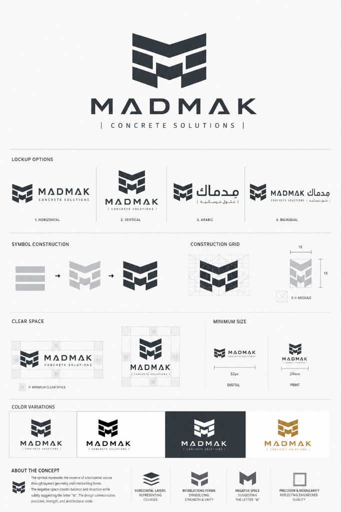

# مصنع مِدماك للحلول الخرسانية والإنترلوك الديكوري 2026
### MADMAK Concrete Solutions & Architectural Pavers Factory — Badr City 2026



<div dir="rtl">

منظومة إدارية وفنية وهندسية متكاملة لدراسة جدوى وتشغيل وتكاليف وتراخيص **مصنع إنترلوك ديكوري وحجر صناعي وبديل خشب خرساني (Wet-Cast Precast Concrete)** بالمنطقة الصناعية (طريق الروبيكي) بمدينة بدر، القاهرة.

محدثة بالكامل وفق اشتراطات الكود المصري، مواصفات **ES 4382**، أسعار خامات وتشغيل **سبتمبر 2026**، وأحكام **القانون المدني المصري رقم 131 لسنة 1948**.

---

## 🌟 محاور النظام الأساسية (System Modules)

المنظومة مصممة بأسلوب معمارية الأنظمة المستقلة عبر 6 واجهات تفاعلية متكاملة:

### 1. لوحة القيادة والمؤشرات الاستراتيجية (`index.html`)
- ملخص تنفيذي للمستثمرين وأصحاب القرار.
- كروت المؤشرات الحيوية (رأس المال المستثمر 900,000 ج.م، الطاقة الإنتاجية 1,500 م²/شهر، فترة استرداد رأس المال 5.8 شهر، ونقطة التعادل 27.5%).
- خريطة طريق تنفيذية من 6 مراحل لبدء التشغيل خلال 60 يوماً.

### 2. دراسة الجدوى المالية والاقتصادية (`financial.html`)
- محاكي مالي ديناميكي تفاعلي لتوقع الإيرادات وهوامش الأرباح وفق سيناريوهات المبيعات.
- هيكل التكاليف الرأسمالية (CapEx) وتكاليف التأسيس والتشغيل الأولي (OpEx).
- جداول التدفقات النقدية والتحليل الحساس لتقلبات أسعار الخامات.

### 3. دراسة الجدوى الهندسية والماكينات والتشريح 3D (`engineering.html`)
- المخطط العام للورشة والمصنع (500 م² مسقوف) وتوزيع خطوط الإنتاج.
- المواصفات الفنية للماكينات الثلاث: **الخلاطة الكوكبية 125 سم**، **طاولة الهزاز الترددية 3 حصان**، و**ماكينة فك القوالب بالهواء المضغوط**.
- **مقطع تشريحي ثلاثي الأبعاد تفاعلي (Interactive 3D Paver Anatomy)** يشرح هندسة الصب على طبقتين (Wet-on-Wet) لمنع انفصال طبقة الوجه الرخامية (1.5 سم) عن الظهرية الإنشائية (4.5 سم).
- **معمل إنترلوك الجرانيكس (Granix / Exposed Aggregate)** لمحاكاة إظهار كسر الجرانيت والرخام الطبيعي بتقنية السيلر والتطعيم الليلي المضيء (Photoluminescent).
- معايير الجودة واختبارات كسر الخرسانة (إجهاد ≥ 450 كجم/سم²) المعتمدة من معمل جامعة بدر (BUC).

### 4. تكاليف التشغيل وتحليل المواد الخام (`costing.html`)
- جدول التسعير اللحظي لخامات السوق المصري (أسمنت بورتلاندي 42.5N، أسمنت أبيض رويال 52.5N، رمل سيليكا زجاجي، سن 0 دولوميت عتاقة، وأكاسيد بايفيرروكس الألمانية).
- تفكيك تكلفة المتر المربع الدقيقة لـ 8 أصناف خرسانية.
- محاكي تحريك أسعار الخامات وأثره المباشر على الأرباح الشهرية.

### 5. دورة الإنتاج المعيارية وعيادة الجودة (`production.html`)
- محاكي حي تفاعلي لمحاكاة تدفق العمليات بين الماكينات الثلاث.
- الإجراءات التشغيلية القياسية (11 خطوة SOP) من التزييت حتى المعالجة بالرش الرذاذي والتعتيق.
- **حاسبة الخلطة والقلبة المعملية الذكية (Smart Batch Calculator)**: حساب نسب الخامات بالميزان بدقة الشكاير (50 كجم)، البراويطة، الجركن، والمتر المكعب لأي طلبية.
- **عيادة الجودة وعلاج عيوب الصب (Troubleshooting Clinic)**: تشخيص فوري لأبرز 6 عيوب ميدانية (تسويس الوجه Pinholes، تكسر السوك، التزهير والتمليح، انفصال الطبقات).
- **اختبار كفاءة مدير الإنتاج (Master Production Quiz)**: تقييم تفاعلي فوري لمهارات مديري التشغيل.

### 6. التراخيص ومولد العقود المعتمدة (`contracts.html`)
- **مولد العقود الرسمية وعروض الأسعار الفورية**: إصدار وثائق تعاقدية قانونية جاهزة للطباعة والختم متوافقة مع أحكام القانون المدني المصري رقم 131 لسنة 1948.
- اشتراطات سداد حازمة (شرط مانع للتنزيل والعتالة والتفريغ بالموقع إلا بعد السداد الكامل).
- **دليل تراخيص مدينة بدر وهيئة التنمية الصناعية (IDA)**: خطوات التراخيص بالإخطار والمستندات والرسوم.
- **خريطة الموردين والمراكز التجارية**: عناوين وأرقام مستودعات القوالب، الخامات، والكيماويات في شق الثعبان، العاشر من رمضان، ومدينة بدر.

---

## 💻 التقنيات المستخدمة (Tech Stack)

تم بناء وتطوير المنظومة بدون أي تعقيدات برمجية أو متطلبات خوادم خلفية ثقيلة لضمان السرعة الفائقة والاعتمادية التامة:

- **الواجهة والهيكلة**: HTML5 الدلالي والمعياري (Semantic Markup).
- **التصميم والتنسيق**: Vanilla CSS3 + Tailwind CSS CDN + التصميم المتجاوب الكامل (Mobile-First Design).
- **البرمجة والتفاعل**: JavaScript الحديث (Vanilla ES6+).
- **الرسوميات والمحاكاة**: متجهات SVG تفاعلية ثلاثية الأبعاد (Interactive SVG / Canvas).
- **الرموز والخطوط**: Font Awesome 6.5.1 + خطوط Google Fonts (Tajawal & Outfit).

---

## 📁 الهيكل التنظيمي للمشروع (Project Structure)

```text
Anterloack/
├── index.html            # لوحة القيادة والمؤشرات الرئيسية
├── financial.html        # دراسة الجدوى المالية والاقتصادية
├── engineering.html      # الجدوى الهندسية، مواصفات الماكينات والمقطع 3D
├── costing.html          # تكاليف التشغيل وأسعار الخامات اللحظية
├── production.html       # حاسبة الخلطات، دورة الإنتاج وعيادة الجودة
├── contracts.html        # مولد العقود الرسمية ودليل تراخيص مدينة بدر
├── 1.html                # نموذج مرجعي تجريبي أولي
├── 2.html                # نموذج مرجعي تجريبي متقدم
├── css/
│   └── styles.css        # التنسيقات العامة، السمات، والأزرار والبطاقات
├── js/
│   ├── data.js           # قاعدة بيانات المشروع والأسعار والمعدات
│   ├── calculators.js    # المحركات الحسابية وحاسبة الخلطات الذكية
│   └── app.js            # منطق الواجهات، محاكاة الماكينات وتوليد العقود
├── assets/               # شعارات مِدماك، صور الماكينات، والأنماط المعمارية
├── .gitignore            # ملف استبعاد الملفات المؤقتة من مستودع Git
└── README.md             # دليل المشروع والتوثيق الشامل
```

---

## 🚀 طريقة التشغيل محلياً (How to Run Locally)

المشروع عبارة عن موقع ويب ثابت (Static Web Application) لا يتطلب تثبيت أي حزم أو قواعد بيانات.

### الخيار 1: فتح مباشر في المتصفح
يمكنك النقر المزدوج على ملف `index.html` لفتحه مباشرة في أي متصفح حديث (Chrome, Edge, Firefox, Safari).

### الخيار 2: عبر خادم محلي خفيف (مُوصى به لتشغيل كافة ميزات المتصفح)
إذا كان لديك **Python** مثبت، افتح سطر الأوامر في مجلد المشروع واكتب:
```bash
python -m http.server 8080
```
ثم افتح في المتصفح: `http://localhost:8080`

أو باستخدام **Node.js**:
```bash
npx serve .
```

---

## 📄 الترخيص وحقوق الملكية (License)

هذا المشروع مخصص للاستخدام والتطبيق الصناعي لمصانع الخرسانة الجاهزة والإنترلوك بجمهورية مصر العربية © 2026 — شركة مِدماك للحلول الخرسانية (MADMAK).

</div>
